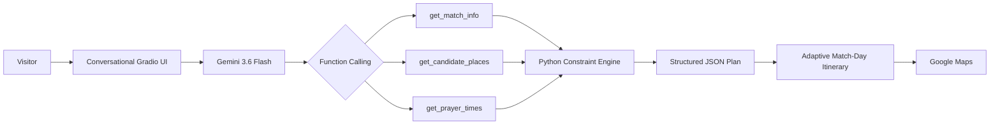

# MASAR 27 | مسار 27 🇸🇦

### من المباراة إلى المدينة… عِش التجربة كاملة.

**AI-powered adaptive match-day travel planner for AFC Asian Cup Saudi Arabia 2027 visitors.**

[](https://colab.research.google.com/github/Jana-i004/MASAR27/blob/main/MASAR27.ipynb)


---

## ✦ About MASAR 27

**MASAR 27** is an AI-powered smart tourism planner that turns match day into a complete city experience.

Instead of treating the football match as an isolated event, MASAR 27 builds a personalized itinerary around it:

**Before the match → Match → After the match**

The system recommends experiences that match the visitor's interests, available time, mobility needs, and transportation preferences while protecting the most important constraint:

> **Arriving at the stadium comfortably and on time.**

The current MVP demonstrates the experience in **Riyadh**, while the product concept is designed to expand across other host cities.

---

## The Problem

Visitors attending major sporting events often have several free hours before or after a match.

The problem is not simply:

> “Where should I go?”

A useful match-day plan must also answer:

> “What can I realistically do without being late for the match?”

This requires considering multiple real-world constraints at the same time:

- Match kickoff time
- Safe stadium arrival time
- Available time before the match
- Visitor interests
- Walking preference and mobility
- Transportation mode
- Prayer times
- High temperatures
- Traffic and crowd conditions
- Group type and size
- Attraction visit duration
- Opening-hour availability
- Travel time between stops

A static list of tourist attractions cannot solve this problem.

**MASAR 27 builds the day around the match, then adapts it when conditions change.**

---

## ✨ Core Experience

The user completes a short conversational planning flow rather than a traditional data-entry form.

The experience asks only for the information needed to personalize the day:

1. Match
2. Start time
3. Interests
4. Transportation
5. Walking preference
6. Group type and size

MASAR 27 then creates a personalized itinerary organized as:

### Before the match → Match → After the match

The interface also explains why each destination was selected and keeps match arrival visible as the highest-priority constraint.

---

## Personalization

### Interests

Users can choose multiple interests, including:

- Heritage & Culture
- Art
- Cafes
- Shopping
- Outdoor Experiences
- Restaurants

Destination ranking considers all selected interests rather than forcing the visitor into a single category.

### Transportation

The current prototype supports:

- Car
- Metro
- Walking

### Group-aware planning

The experience adapts based on whether the visitor is:

- Travelling alone
- With friends
- With family
- With another group type supported by the interface

When the visitor selects **travelling alone**, group size is automatically set to one instead of asking an unnecessary question.

---

## Mobility-Aware Planning

Walking preference is treated as an actual planning constraint, not just a display field.

Each destination in the project dataset includes a walking-load attribute.

MASAR 27 uses that attribute to prioritize suitable destinations based on the visitor's preferred walking level.

The planner becomes more conservative when the user selects:

- Short walking distances
- Lower mobility
- Fatigue conditions

This allows the itinerary to adapt to the visitor rather than expecting every visitor to follow the same route.

---

## 🔄 Adaptive Replanning

A real match-day plan cannot remain static when the visitor's situation changes.

MASAR 27 allows the visitor to report a change and rebuild the remaining day.

The current prototype supports:

- High heat
- High traffic
- 45-minute delay
- Fatigue
- Prayer-time considerations

After replanning, the interface clearly indicates:

### **خطة يومك بعد التعديل**

It also explains what changed and why.

For example:

**Original plan**

`9:00 AM → Experience → Experience → Prayer → Stadium`

**After a 45-minute delay**

`9:45 AM → Experience → Prayer → Stadium`

The number and timing of destinations can change, but the match deadline remains protected.

---

## Before the Whistle

A key MASAR 27 feature is the ability to determine how much of the city can safely fit before the match.

Instead of showing the user a technical concept such as a “safe time window,” the interface communicates it naturally:

> **قبل المباراة نقدر نضيف لك تجارب بدون استعجال، ونخلي وصولك للملعب في الوقت المناسب.**

This turns time constraints into a simple user-facing decision.

---

## 🧠 AI Architecture



MASAR 27 uses a hybrid AI architecture:

**Gemini personalizes and reasons.  
Python validates hard constraints.**

This prevents critical match-day rules from depending entirely on generative output.

---

## Gemini Capabilities

MASAR 27 uses Gemini capabilities beyond basic text chat.

### Function Calling

Gemini can call trusted project functions instead of inventing match or destination information.

Implemented functions:

```text
get_match_info
get_candidate_places
get_prayer_times
```

#### `get_match_info`

Retrieves information about the selected match from the project dataset.

#### `get_candidate_places`

Filters and ranks potential destinations based on:

- Interests
- Mobility
- Walking preference
- Group profile
- Transportation
- Available time
- Heat condition
- Crowd condition
- Match deadline

#### `get_prayer_times`

Retrieves prayer times for the selected match date and allows the planner to reserve prayer time within the itinerary.

---

## Structured Output

Gemini returns the plan in structured form rather than unrestricted text.

This allows the application to:

- Validate itinerary items
- Enforce time constraints
- Prevent duplicate destinations
- Render a consistent interface
- Rebuild the plan when conditions change

A successful Gemini execution produces a technical trace similar to:

```json
{
  "planning_mode": "gemini",
  "gemini_api_key_detected": true,
  "functions_called": [
    "get_candidate_places",
    "get_match_info",
    "get_prayer_times"
  ],
  "structured_output": true
}
```

---

## Constraint Engine

After Gemini generates the proposed itinerary, a deterministic Python layer validates the result.

The engine considers:

- Match kickoff
- Stadium arrival deadline
- Available planning window
- Travel estimates
- Visit duration
- Prayer-time conflicts
- Walking load
- Mobility preference
- Heat suitability
- Prototype crowd estimate
- Duplicate destination prevention
- Before-match sequencing
- After-match sequencing

If a suggestion conflicts with a hard constraint, the application adjusts the plan before displaying it to the user.

---

## Prayer-Aware Planning

Prayer is treated as part of the itinerary rather than an afterthought.

MASAR 27 retrieves prayer times for the selected match date using the **AlAdhan API**.

When a prayer overlaps the visitor's planning window, the system reserves time for prayer without compromising match arrival.

For example:

`Destination → Dhuhr Prayer → Stadium`

Prayer times are used for prototype planning and should be locally verified before travel.

---

## Heat-Aware Planning

High temperatures can make an otherwise suitable tourist plan uncomfortable or impractical.

When the visitor selects **High Heat**, MASAR 27 gives stronger priority to indoor destinations.

During testing, the system successfully shifted recommendations toward indoor experiences while preserving the stadium-arrival constraint.

---

## Crowd-Aware Planning

The challenge requires awareness of crowd conditions at each stop.

The current MVP calculates a **prototype crowd estimate for candidate destinations** and uses it as a ranking signal when high congestion is selected.

This helps the planner:

- Increase travel buffers
- Reduce unnecessary stops
- Prefer more suitable destinations
- Protect stadium arrival

> Crowd values in the current prototype are planning estimates and are **not live occupancy data**.

---

## 🗺️ Google Maps Integration

MASAR 27 integrates Google Maps into the visitor journey.

Each destination can provide:

### Open Location

Opens Google Maps using the **destination name** rather than exposing raw latitude and longitude to the visitor.

### Route to Stadium

Opens directions from the selected destination to the match stadium.

Coordinates remain available internally for geographic calculations, while the visitor sees recognizable destination names.

The current integration uses Google Maps place search and directions links rather than a full live routing API.

---

## Data

The project's primary dataset is:

```text
MASAR27_DATA.xlsx
```

The workbook contains four sheets:

| Sheet | Purpose |
|---|---|
| `Matches_All` | AFC Asian Cup 2027 match information |
| `Places_Riyadh` | Riyadh tourism destinations and planning attributes |
| `Sources` | Data provenance and references |
| `Test_Cases` | Functional and adaptive-planning validation |

---

## Dataset Overview

The current project dataset includes:

- **51 tournament matches**
- **31 Riyadh matches used by the MVP**
- **30 Riyadh tourism destinations**

Each destination can include attributes such as:

- Arabic name
- English name
- Category
- Latitude
- Longitude
- Indoor / outdoor classification
- Estimated visit duration
- Walking load
- Family suitability
- Opening-hour status
- Data source

---

## Data Sources

The dataset documents the origin of project information.

Sources include:

- AFC
- AsianCup2027Tickets
- Visit Saudi
- JAX District official resources
- Saudi Ministry of Culture
- AlAdhan API for prayer-time planning

Some fields are intentionally identified as prototype estimates rather than verified live values.

These include:

- Visit duration estimates
- Walking load
- Crowd estimates
- Travel-time estimates

Some attraction opening hours are marked:

```text
LIVE_CHECK
```

This indicates that opening hours should be verified before the actual visit.

---

## Match-Time Status

Match kickoff times used in the current prototype are treated as:

```text
Provisional
```

until a final official schedule is available.

MASAR 27 surfaces this limitation rather than presenting provisional information as confirmed.

---

## ✅ Validation

The project contains predefined test cases covering both normal use and constraint-heavy scenarios.

Examples include:

- Normal planning
- Low mobility
- High heat
- High traffic
- Fatigue
- Prayer time
- 45-minute delay
- Long free-time window
- Short free-time window

Three full end-to-end Gemini scenarios were also executed and documented during development.

| Scenario | Observed Behavior | Result |
|---|---|---|
| Normal | Built a personalized itinerary before and after the match, inserted prayer time, preserved stadium arrival, and avoided repeating destinations | PASS |
| High Heat | Shifted recommendations toward indoor destinations while preserving stadium arrival | PASS |
| Delayed 45 Minutes | Moved the effective start time, reduced pre-match stops, and preserved stadium arrival | PASS |

The tests demonstrate that MASAR 27 does not simply return a fixed itinerary.

### **When the conditions change, the plan changes.**

---

## Example Adaptive Behavior

### Normal conditions

The planner was able to schedule multiple experiences before the match while maintaining the stadium deadline.

### High heat

Indoor destinations received priority.

### High traffic

The system increased the arrival buffer and became more conservative with the available itinerary.

### 45-minute delay

The visitor's effective start time moved later and the number of destinations was reduced.

In each scenario, the match remained the highest-priority constraint.

---

## Technology Stack

| Technology | Purpose |
|---|---|
| Python | Core application and constraint engine |
| Gemini 3.6 Flash | AI planning and personalization |
| Google GenAI SDK | Gemini API integration |
| Gemini Function Calling | Trusted project-data access |
| Structured Output | Structured itinerary generation |
| Gradio | Interactive web interface |
| Pandas | Dataset processing |
| OpenPyXL | Excel workbook support |
| Pydantic | Structured data handling |
| Requests | External API communication |
| Google Maps | Location search and directions |
| AlAdhan API | Prayer-time retrieval |
| Google Colab | Primary execution environment |

---

## ▶️ Run MASAR 27

The easiest way to run the project is through Google Colab.

### 1. Open the Notebook

Click:

[](https://colab.research.google.com/github/Jana-i004/MASAR27/blob/main/MASAR27.ipynb)

---

### 2. Create a Gemini API Key

Create a Gemini API key using **Google AI Studio**.

---

### 3. Add the Key to Colab Secrets

Inside Google Colab, open:

**Secrets**

Create a secret with the exact name:

```text
GEMINI_API_KEY
```

Paste the Gemini API key into its value field.

Enable:

**Notebook access**

> 🔐 Never paste the API key directly into the notebook or commit it to GitHub.

---

### 4. Run the Project

From Colab select:

```text
Runtime → Run all
```

The notebook will initialize the project and launch the Gradio application.

---

### 5. Open the Application

Colab generates a temporary public URL similar to:

```text
https://xxxxx.gradio.live
```

Open that link to use MASAR 27.

---

## Dataset Loading

The notebook first checks for:

```text
MASAR27_DATA.xlsx
```

The final notebook also contains an embedded dataset snapshot as a resilience fallback.

This means the hackathon demo can still start if the external Excel workbook is not immediately available.

The Excel workbook remains the primary readable and documented project dataset.

---

## Repository Structure

```text
MASAR27/
│
├── MASAR27.ipynb
├── MASAR27_DATA.xlsx
└── README.md
```

---

## MVP Scope 🇸🇦

The current demonstration is focused on **Riyadh**.

This is an MVP scope decision, not a limitation of the MASAR 27 concept.

The full concept is designed to support:

- Other tournament host cities
- Additional stadiums
- More tourism destinations
- Future major sporting events
- Tourism seasons and large-scale events

---

## Current Limitations

MASAR 27 is a hackathon prototype.

The current version intentionally distinguishes implemented functionality from future live integrations.

- Riyadh is the current demo city.
- Match kickoff times are provisional.
- Travel times are conservative estimates rather than live traffic data.
- Crowd levels are prototype estimates rather than live occupancy data.
- Some attraction opening hours require a live check.
- Prayer times should be locally verified before travel.
- Google Maps integration currently uses search and directions links rather than a complete live routing engine.

These limitations are explicitly surfaced rather than hidden from the user.

---

## 🚀 Future Roadmap

Future versions of MASAR 27 can include:

- Expansion to all AFC Asian Cup 2027 host cities
- Live Google Maps routing and traffic
- Live weather and heat-risk signals
- Live destination opening hours
- Verified accessibility attributes
- Live crowd-density signals
- Multi-modal transportation planning
- Arabic / English interface switching
- Event ticket integration
- Personalized saved itineraries
- Expansion beyond football into major events and tourism seasons

---

## Challenge

MASAR 27 was developed for:

### AI Champion Challenge 2026

**Tuwaiq Academy × Google Developers**

Track:

### Smart Tourism — 3B: AI-Powered Daily Planner

The track focuses on building a daily planner that considers:

- Mobility needs
- Prayer times
- Heat
- Crowd levels at each stop
- Maps integration
- Function Calling
- Real-world constraints

The challenge also requires using at least one Gemini capability beyond basic text chat.

MASAR 27 implements:

**Gemini Function Calling + Structured Output**

along with a deterministic Python constraint engine and adaptive replanning.

---

## 👥 Team

MASAR 27 is a two-person hackathon project.

- [@Jana-i004](https://github.com/Jana-i004)
- [@RandGob](https://github.com/RandGob)

---

## Disclaimer

**MASAR 27 is an independent hackathon prototype and is not an official AFC service.**

Users should verify final match schedules, venue information, attraction opening hours, prayer times, and current travel conditions before making real-world decisions.

---

<p align="center">
  <strong>MASAR 27 | مسار 27 🇸🇦</strong><br>
  من المباراة إلى المدينة… عِش التجربة كاملة.
</p>
